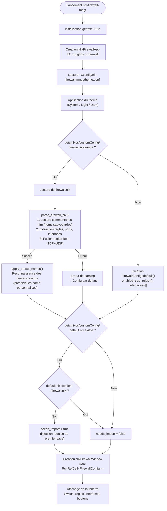
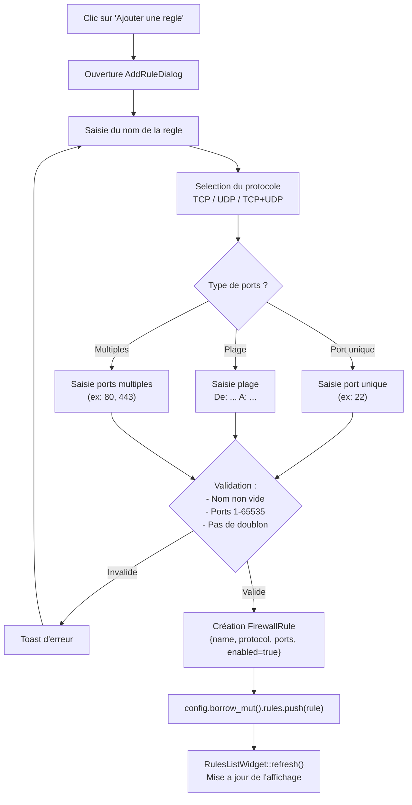
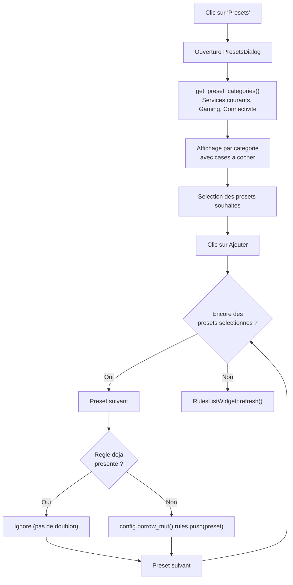
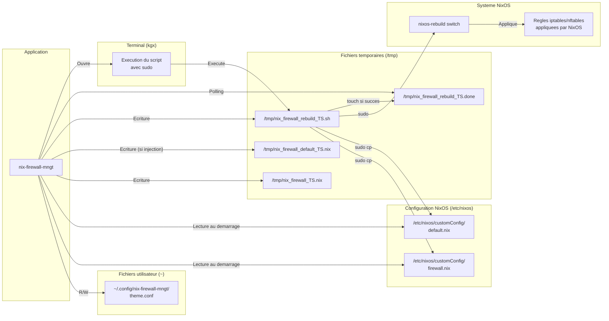
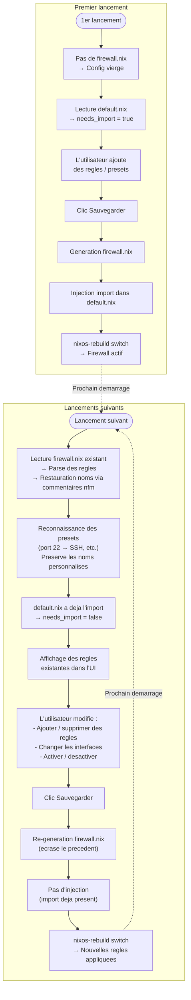

# Architecture de Nix Firewall Manager

## Vue d'ensemble

Nix Firewall Manager est une application GUI permettant de gerer les regles de pare-feu NixOS/GLF-OS. Elle est ecrite en Rust avec GTK4 et Libadwaita, construite via Meson + Cargo, et empaquetee pour NixOS.

**ID d'application** : `org.glfos.nixfirewall`
**Binaire** : `nix-firewall-mngt`
**Licence** : GPL-3.0-or-later

## Pile technologique

| Composant | Technologie | Version |
|-----------|-------------|---------|
| Langage | Rust | Edition 2021 |
| Toolkit GUI | GTK4 | 0.9 (v4_10) |
| Widgets modernes | Libadwaita | 0.7 (v1_4) |
| Systeme de build | Meson + Cargo | - |
| Internationalisation | gettext-rs | 0.7 |
| Parsing | regex | 1.10 |
| Gestion d'erreurs | anyhow + thiserror | 1.0 |

## Structure du projet

```
nix-firewall-mngt/
├── src/
│   ├── main.rs                     # Point d'entree
│   ├── models/
│   │   ├── mod.rs                  # Exports du module
│   │   ├── firewall_config.rs      # Structures de donnees (FirewallConfig, FirewallRule, etc.)
│   │   └── presets.rs              # Presets de regles predefinies
│   ├── utils/
│   │   ├── mod.rs                  # Exports du module
│   │   ├── nix_parser.rs           # Lecture et parsing de firewall.nix
│   │   └── nix_writer.rs           # Generation du contenu firewall.nix
│   └── ui/
│       ├── mod.rs                  # Exports du module
│       ├── app.rs                  # Controlleur applicatif (lifecycle GTK)
│       ├── window.rs               # Fenetre principale et logique de sauvegarde/rebuild
│       ├── widgets/
│       │   ├── mod.rs
│       │   └── rules_list.rs       # Widget liste des regles
│       └── dialogs/
│           ├── mod.rs
│           ├── add_rule.rs         # Dialogue ajout/edition de regle
│           └── presets.rs          # Dialogue selection de presets
├── data/
│   ├── meson.build                 # Installation des fichiers data
│   ├── org.glfos.nixfirewall.desktop.in  # Fichier .desktop (template)
│   ├── org.glfos.nixfirewall.in          # Politique PolicyKit (template)
│   └── icons/
│       ├── meson.build             # Installation des icones
│       ├── nix-firewall-mngt.svg   # Icone SVG (scalable)
│       └── nix-firewall-mngt-*.png # Icones PNG (16 a 512px)
├── po/
│   ├── meson.build                 # Configuration i18n
│   ├── POTFILES                    # Liste des fichiers traduisibles
│   ├── LINGUAS                     # Langues supportees
│   ├── en.po / fr.po / br.po      # Traductions (en, fr, br, de, es, it, nl, pt, wa)
│   └── ...
├── Cargo.toml                      # Manifest Rust
├── Cargo.lock                      # Versions verrouillees
├── meson.build                     # Build principal Meson
├── build-rust.sh                   # Script de compilation Cargo
├── flake.nix                       # Environnement de dev Nix
└── default.nix                     # Definition du paquet NixOS
```

## Architecture en couches

```
┌─────────────────────────────────────────────────┐
│  Couche UI (GTK4 + Libadwaita)                  │
│  ├── NixFirewallWindow (window.rs)              │
│  │   ├── Banners (rebuild en cours / erreur)    │
│  │   ├── Header Bar (theme)                     │
│  │   ├── ScrolledWindow                         │
│  │   │   ├── Switch firewall enable/disable     │
│  │   │   ├── Trusted Interfaces card            │
│  │   │   └── RulesListWidget                    │
│  │   └── ActionBar fixe (bas de fenetre)        │
│  │       ├── Boutons Ajouter / Presets          │
│  │       └── Bouton Sauvegarder et Reconstruire │
│  ├── RulesListWidget (rules_list.rs)            │
│  ├── AddRuleDialog (add_rule.rs)                │
│  └── PresetsDialog (presets.rs)                 │
└──────────────────┬──────────────────────────────┘
                   │ Rc<RefCell<FirewallConfig>>
┌──────────────────▼────────────────────────────────┐
│  Couche Modeles                                   │
│  ├── FirewallConfig { enabled, rules, interfaces} │
│  ├── FirewallRule { name, protocol, ports, on }   │
│  ├── Protocol (Tcp | Udp | Both)                  │
│  ├── PortSpec (Single | Range | Multiple)         │
│  └── PresetCategory { name, rules }               │
└──────────────────┬────────────────────────────────┘
                   │
┌──────────────────▼──────────────────────────────┐
│  Couche Utilitaires                             │
│  ├── parse_firewall_nix()  : String → Config    │
│  │   ├── parse_nfm_comments() : noms sauvegardes│
│  │   └── merge_both_rules() : fusion TCP+UDP    │
│  ├── generate_firewall_nix() : Config → String  │
│  │   └── Ecrit commentaires # nfm:rule:...      │
│  ├── inject_firewall_import() : default.nix     │
│  └── default_nix_has_firewall_import()          │
└──────────────────┬──────────────────────────────┘
                   │
┌──────────────────▼──────────────────────────────┐
│  Integration systeme NixOS                      │
│  ├── /etc/nixos/customConfig/firewall.nix       │
│  ├── /etc/nixos/customConfig/default.nix        │
│  ├── /etc/nixos/flake.nix (detection flake)     │
│  ├── nixos-rebuild switch [--flake] (terminal)  │
│  └── PolicyKit (elevation de privileges)        │
└─────────────────────────────────────────────────┘
```

## Diagrammes de flux

### Initialisation de l'application

Au demarrage, l'application charge la configuration existante ou cree une configuration vierge.



### Ajout d'une regle manuelle

L'utilisateur peut ajouter une regle via le dialogue dedie.



### Ajout via les presets

L'utilisateur peut importer des regles predefinies par categorie.



### Edition et suppression d'une regle

```mermaid
flowchart TD
    subgraph Edition
        click_edit["Clic sur le bouton Edit<br/>d'une regle existante"]
        open_edit["AddRuleDialog::new_edit()<br/>Pre-rempli avec les valeurs actuelles"]
        modify["Modification des champs"]
        save_edit["config.rules[index] = updated_rule"]
        refresh_edit["RulesListWidget::refresh()"]

        click_edit --> open_edit --> modify --> save_edit --> refresh_edit
    end

    subgraph Suppression
        click_del["Clic sur le bouton Supprimer"]
        confirm["Confirmation de suppression"]
        remove["config.borrow_mut().rules.remove(index)"]
        refresh_del["RulesListWidget::refresh()"]

        click_del --> confirm --> remove --> refresh_del
    end

    subgraph Toggle
        click_check["Clic sur la checkbox<br/>d'une regle"]
        toggle["rule.enabled = !rule.enabled"]
        note["Les regles desactivees sont<br/>exclues de firewall.nix"]

        click_check --> toggle --> note
    end
```



### Sauvegarde et reconstruction NixOS

Le flux complet de `do_save_and_rebuild()`, de la generation du fichier a la reconstruction systeme.

```mermaid
flowchart TD
    click_save["Clic sur 'Sauvegarder et Reconstruire'"]
    gen_nix["generate_firewall_nix(config)<br/>1. Ecrit commentaires # nfm:rule:...<br/>2. Genere le contenu Nix"]
    write_tmp["Ecriture /tmp/nix_firewall_TIMESTAMP.nix"]
    write_err{Ecriture OK ?}
    banner_err1["Banniere d'erreur"]

    check_inject{"needs_import<br/>== true ?"}
    read_default["Lecture de default.nix"]
    inject["inject_firewall_import()<br/>1. Supprime networking.firewall.allowed*<br/>2. Si imports existe : append ./firewall.nix<br/>3. Sinon : cree imports = ./firewall.nix"]
    write_default_tmp["Ecriture /tmp/nix_firewall_default_TIMESTAMP.nix"]
    inject_err{"Injection OK ?"}
    banner_err2["Banniere d'erreur<br/>+ nettoyage /tmp"]

    gen_script["Creation du script bash<br/>/tmp/nix_firewall_rebuild_TIMESTAMP.sh"]
    script_content["Contenu du script :<br/>1. sudo cp firewall.nix → /etc/nixos/customConfig/<br/>2. sudo cp default.nix (si injection)<br/>3. Detection flake : grep nixosConfigurations<br/>4. sudo nixos-rebuild switch [--flake]<br/>5. touch .done si succes<br/>6. Nettoyage des fichiers /tmp"]
    chmod["chmod +x sur le script"]

    try_term{"Recherche d'un terminal"}
    term_list["Ordre de tentative :<br/>kgx → gnome-terminal →<br/>konsole → xfce4-terminal →<br/>alacritty → kitty → xterm"]
    term_found{Terminal trouve ?}
    no_term["Banniere d'erreur :<br/>Aucun terminal disponible"]

    show_banner["Banniere : Reconstruction en cours..."]
    term_exec["Le terminal execute le script :<br/>┌────────────────────────────────┐<br/>│ sudo cp des fichiers config    │<br/>│ sudo nixos-rebuild switch      │<br/>│ → succes : touch .done         │<br/>│ → echec : message d'erreur     │<br/>│ Nettoyage fichiers temporaires │<br/>│ 'Vous pouvez fermer...'        │<br/>└────────────────────────────────┘"]

    poll_start["Polling toutes les 2 secondes"]
    check_done{".done existe ?"}
    check_timeout{"300 checks<br/>(10 min) ?"}
    poll_wait["Attente 2s"]
    success["Banniere masquee<br/>Toast : Configuration appliquee"]
    timeout["Banniere masquee<br/>Timeout silencieux"]
    cleanup["Nettoyage :<br/>rm .done, rm script.sh"]

    click_save --> gen_nix --> write_tmp --> write_err
    write_err -->|Non| banner_err1
    write_err -->|Oui| check_inject

    check_inject -->|Oui| read_default --> inject --> write_default_tmp --> inject_err
    inject_err -->|Non| banner_err2
    inject_err -->|Oui| gen_script
    check_inject -->|Non| gen_script

    gen_script --> script_content --> chmod --> try_term
    try_term --> term_list --> term_found
    term_found -->|Non| no_term
    term_found -->|Oui| show_banner --> term_exec

    term_exec --> poll_start --> check_done
    check_done -->|Oui| success --> cleanup
    check_done -->|Non| check_timeout
    check_timeout -->|Oui| timeout
    check_timeout -->|Non| poll_wait --> check_done
```



### Interactions avec les fichiers systeme

Vue d'ensemble des fichiers lus et ecrits par l'application.



### Cycle de vie complet : du premier lancement a l'exploitation



## Modele de donnees

### FirewallConfig
Structure centrale representant l'etat complet du pare-feu :
- `enabled: bool` - pare-feu actif ou non
- `rules: Vec<FirewallRule>` - liste des regles
- `trusted_interfaces: Vec<String>` - interfaces de confiance (ex: docker0)

### FirewallRule
Une regle de pare-feu nommee :
- `name: String` - nom affiche (ex: "SSH", "Steam")
- `protocol: Protocol` - TCP, UDP ou Both
- `ports: PortSpec` - specification des ports
- `enabled: bool` - regle active ou non

### PortSpec
Trois variantes pour specifier les ports :
- `Single(u16)` - un port unique (ex: 22)
- `Range(u16, u16)` - une plage (ex: 27015-27030)
- `Multiple(Vec<u16>)` - plusieurs ports (ex: 80, 443)

### Protocol
- `Tcp` - protocole TCP uniquement
- `Udp` - protocole UDP uniquement
- `Both` - les deux protocoles (genere des regles TCP et UDP)

## Flux de sauvegarde et reconstruction

Le flux de sauvegarde (`do_save_and_rebuild()` dans `window.rs`) est le coeur de l'application :

```
1. Generation du contenu firewall.nix
   Config → generate_firewall_nix() → String Nix
   → Ecrit les commentaires # nfm:rule:<nom>:<proto>:<ports> pour chaque regle
   → Genere les blocs allowedTCPPorts, allowedUDPPorts, etc.

2. Ecriture en fichier temporaire
   → /tmp/nix_firewall_<timestamp>.nix

3. Si besoin, injection de l'import dans default.nix
   → inject_firewall_import() retire les regles firewall existantes
   → si un bloc `imports` existe deja, ajoute `./firewall.nix` a la liste
   → sinon, cree `imports = [ ./firewall.nix ];` apres le 2e `{`
   → ecrit dans /tmp/nix_firewall_default_<timestamp>.nix

4. Creation du script de rebuild
   → /tmp/nix_firewall_rebuild_<timestamp>.sh
   → Contient : sudo cp des fichiers
   → Detection flake : grep nixosConfigurations dans /etc/nixos/flake.nix
   → Si flake detecte : sudo nixos-rebuild switch --flake "/etc/nixos#<attr>"
   → Sinon : sudo nixos-rebuild switch

5. Ouverture d'un terminal
   → Essaie dans l'ordre : kgx, gnome-terminal, konsole, xfce4-terminal, alacritty, kitty, xterm
   → Le terminal execute le script de rebuild

6. Surveillance de la completion
   → Polling toutes les 2s du fichier /tmp/nix_firewall_rebuild_<timestamp>.done
   → Cree par le script si rebuild reussi (touch)
   → Timeout apres 10 minutes (300 checks)
   → Toast de succes a la detection du fichier
```

### Pourquoi des fichiers temporaires ?

L'ecriture dans `/etc/nixos/` necessite les droits root. L'application ecrit d'abord dans `/tmp/` (accessible sans droits), puis le script utilise `sudo cp` pour copier vers la destination finale. Cela permet de dissocier la logique applicative de l'elevation de privileges.

## Systeme de presets

Les presets sont definis dans `models/presets.rs` et organises par categories :

| Categorie | Preset | Protocole | Ports |
|-----------|--------|-----------|-------|
| Services courants | SSH | TCP | 22 |
| Services courants | HTTP / HTTPS | TCP | 80, 443 |
| Services courants | DNS | UDP | 53 |
| Gaming | Steam | TCP+UDP | 27015-27030 |
| Gaming | Sunshine / Moonlight | TCP+UDP | 47984-47990 |
| Gaming | Minecraft Serveur | TCP | 25565 |
| Connectivite | KDE Connect | TCP+UDP | 1714-1764 |
| Connectivite | Syncthing | TCP | 22000, 21027 |
| Connectivite | Samba (TCP) | TCP | 139, 445 |
| Connectivite | Samba (UDP) | UDP | 137, 138 |

Le parser (`apply_preset_names()`) tente de reconnaitre les regles parsees correspondant a des presets connus pour leur donner un nom lisible. Les noms personnalises (restaures depuis les commentaires nfm) ne sont pas ecrases par les presets.

## Persistance des noms de regles

Les noms de regles personnalises sont sauvegardes en commentaires dans `firewall.nix` :

```nix
# Fichier genere par Nix Firewall Manager - Ne pas editer manuellement
# Generated by Nix Firewall Manager - Do not edit manually
# nfm:rule:SSH:tcp:22
# nfm:rule:Mon serveur web:tcp:80,443
# nfm:rule:Steam:both:27015-27030
{ lib, config, pkgs, ... }:
...
```

### Format des commentaires nfm

```
# nfm:rule:<nom>:<protocole>:<ports>
```

- `<nom>` : nom de la regle tel qu'affiche dans l'UI
- `<protocole>` : `tcp`, `udp` ou `both`
- `<ports>` : port unique (`22`), plage (`27015-27030`) ou multiples (`80,443`)

### Processus de restauration au parsing

1. `parse_nfm_comments()` : extrait les metadonnees des commentaires
2. `find_saved_name()` : associe chaque port/plage parse a son nom sauvegarde
3. `merge_both_rules()` : fusionne les paires TCP/UDP en regles `Protocol::Both` quand un commentaire `both` est present
4. `apply_preset_names()` : ne renomme que les regles avec des noms generiques (ex: "TCP 22"), preserve les noms personnalises

### Verification des noms generiques

La fonction `is_generic_name()` detecte les noms auto-generes (format `<PROTO> <port>`) pour eviter d'ecraser un nom personnalise avec un nom de preset.

## Detection flake pour le rebuild

Le script de rebuild detecte automatiquement si le systeme utilise un flake NixOS :

1. Verifie l'existence de `/etc/nixos/flake.nix`
2. Extrait le nom de la `nixosConfiguration` via `grep -oP`
3. Si trouve : utilise `nixos-rebuild switch --flake "/etc/nixos#<nom>"`
4. Sinon : utilise `nixos-rebuild switch` classique

Cela resout le probleme ou le hostname de la machine ne correspond pas au nom declare dans `nixosConfigurations` du flake.

## Integration GNOME

Pour que l'icone apparaisse dans la barre des taches GNOME, trois elements doivent correspondre :

1. **Application ID** (`org.glfos.nixfirewall` dans `app.rs`)
2. **Fichier .desktop** (`org.glfos.nixfirewall.desktop`)
3. **Icones** installees sous le nom `org.glfos.nixfirewall.{svg,png}`

GNOME Shell associe les fenetres aux fichiers .desktop via l'application ID. Si le nom du .desktop ne correspond pas, l'icone generique est utilisee.

## Gestion du theme

L'application supporte 3 modes de theme :
- **System** : suit la preference du systeme (defaut)
- **Light** : force le theme clair
- **Dark** : force le theme sombre

La preference est sauvegardee dans `~/.config/nix-firewall-mngt/theme.conf` (fichier texte contenant "system", "light" ou "dark"). Le theme est applique au demarrage via `adw::StyleManager`.

## Internationalisation (i18n)

L'application utilise `gettext-rs` pour la traduction :
- Les chaines traduisibles sont marquees avec `gettext()` dans le code
- Les fichiers `.po` contiennent les traductions
- Meson compile les `.po` en `.mo` (format binaire) a l'installation
- `LOCALE_DIR` est passe a la compilation pour localiser les fichiers `.mo`

Langues supportees : francais (fr), anglais (en), breton (br), allemand (de), espagnol (es), italien (it), neerlandais (nl), portugais (pt), wallon (wa)

## PolicyKit

La politique PolicyKit (`org.glfos.nixfirewall.policy`) definit les regles d'elevation de privileges :
- **Utilisateur actif** : `auth_admin_keep` - demande le mot de passe admin, garde la session
- **Utilisateur inactif** : `auth_admin` - demande le mot de passe admin
- **Tout utilisateur** : `auth_admin` - demande le mot de passe admin

Cela permet l'execution de `sudo nixos-rebuild switch` dans le terminal ouvert par l'application.
